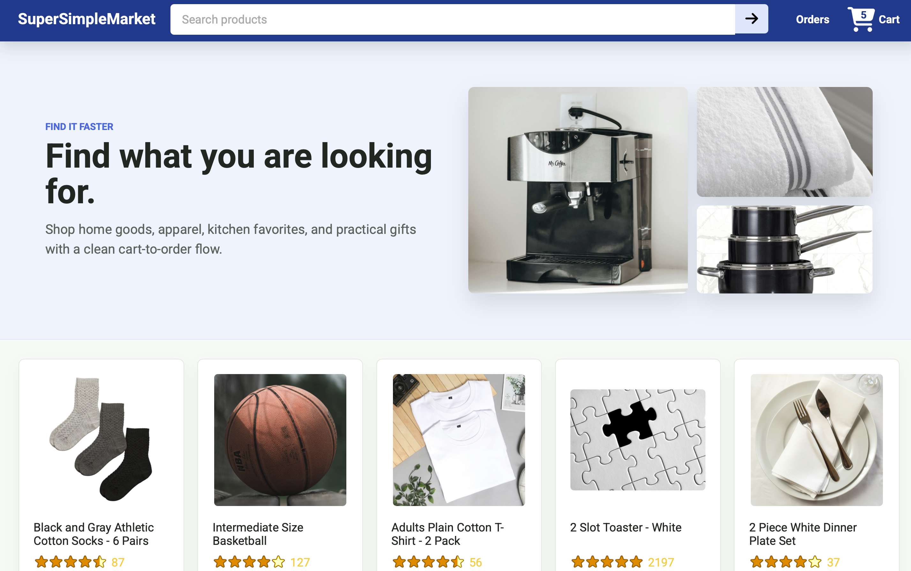
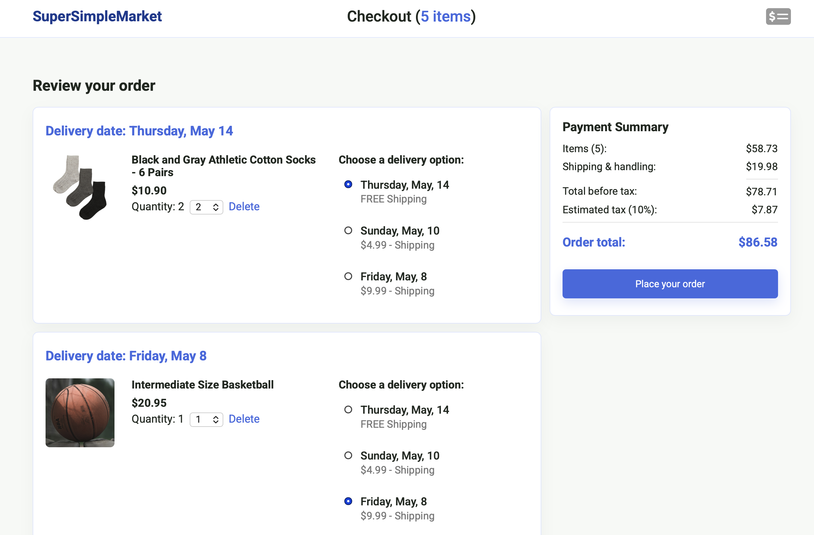
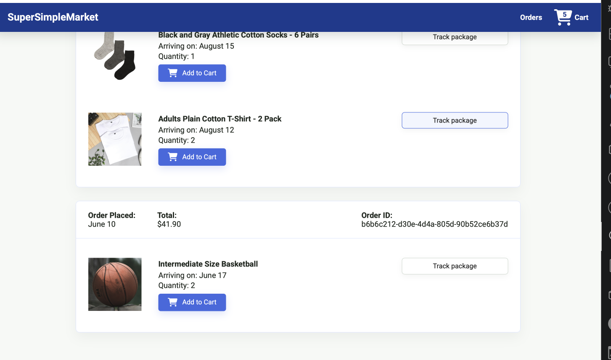

# SuperSimpleMarket

SuperSimpleMarket is a full-stack ecommerce demo with a React + TypeScript frontend and an Express/Sequelize backend. It includes product browsing, search, cart management, checkout, order history, package tracking, and a small test suite.

The project started from a SuperSimpleDev ecommerce tutorial and was extended with a cleaner repo structure, TypeScript cleanup, a custom backend flow, tests, improved UI polish, empty states, working search, buy-again behavior, tracking routes, and an order success page.

## Screenshots







## Project Structure

```text
react-ecommerce-web/
  frontend/             React, TypeScript, Vite, Vitest
  backend/              Express API, Sequelize models, seed data, product assets
  tutorial-js-version/  Original/older JavaScript tutorial version kept for reference
  docs/screenshots/     README preview images
  README.md
```

## Tech Stack

- React 19
- TypeScript
- Vite
- React Router
- Axios
- Vitest + Testing Library
- Node.js + Express
- Sequelize
- sql.js-backed local database setup

## Features

- Product grid with real API data
- Product search by name and keywords
- Add to cart and buy again
- Cart quantity count in the header and checkout
- Delivery option selection
- Editable cart item quantity
- Payment summary and order creation
- Order success page
- Order history with tracking links
- Dynamic package tracking page
- Empty cart, empty orders, and empty search states
- Responsive layout and improved card/button styling

## Run Locally

Install and start the backend:

```bash
cd backend
npm install
npm start
```

The backend runs on `http://localhost:3000`.

Install and start the frontend in a second terminal:

```bash
cd frontend
npm install
npm run dev
```

Open the Vite URL shown in the terminal, usually `http://localhost:5173`.

## Scripts

Frontend:

```bash
cd frontend
npm run dev
npm run build
npm run lint
npm test
```

Backend:

```bash
cd backend
npm start
npm run dev
```

## Notes

- The Vite dev server proxies `/api` requests to `http://localhost:3000`.
- `npm run build` in `frontend/` outputs the production frontend into `backend/dist`.
- `tutorial-js-version/` is intentionally kept as a labeled reference folder, not the main app.

## Acknowledgments

This project is based on the ecommerce project tutorial by [SuperSimpleDev / SuperSimpleDiv](https://www.youtube.com/@SuperSimpleDev). I used the tutorial as the foundation and extended it with a cleaner full-stack structure, TypeScript-focused frontend work, backend integration, testing, UI polish, search, checkout updates, tracking, empty states, and README documentation.
